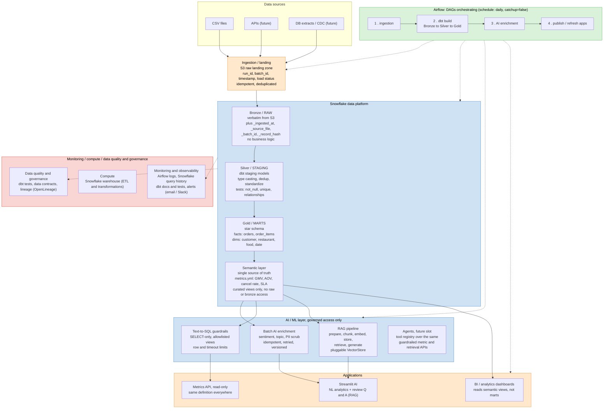

# Food Delivery Data + AI Platform: An Architecture Case Study


A reference implementation of a modern data platform for a food-delivery
marketplace: governed ingestion, a medallion warehouse, a semantic layer,
and an AI layer (batch enrichment, RAG, guardrailed text-to-SQL) that reads
*only* trusted, tested data, never raw tables. The architecture is
company-agnostic by design: swap in any food-delivery business (or, with
minor changes, any transactional marketplace) and the same layers,
contracts, and guardrails still apply.

This started as a redesign of an existing portfolio pipeline (S3 →
Snowflake → dbt → an LLM provider → Streamlit, orchestrated by one linear
Airflow DAG). The goal this time was different: not to rewrite the code,
but to turn it into something you could hand to a hiring manager, or a new
hire, as "here's how we'd actually build this in 2026," and be able to
defend every choice in it, including the ones that were left out.

If you have ten minutes: read this file. If you want the reasoning behind a
specific decision, the [ADRs](docs/decisions/) name the alternative and why
it lost.

---

## 1. Business problem

A food-delivery platform needs:

1. Numbers that finance, ops, and product all agree on: revenue,
   cancellations, delivery SLA, restaurant performance.
2. Structured signal out of a growing pile of free-text customer reviews,
   without a team manually tagging them.
3. Self-serve analytics for non-SQL stakeholders, without every question
   becoming a data-team ticket.
4. All of the above buildable and operable by a **small team** (2-5 data
   engineers), without infrastructure sized for a company 100x this scale.

## 2. Architectural goals

- **One source of truth for business logic**: a metric defined once,
  reused by dashboards, AI, and text-to-SQL alike.
- **Governed AI**: LLMs read curated, tested data, write through
  auditable, idempotent, retryable pipelines, and never touch raw tables.
- **Traceable data**: every row traces back to a source file, a batch, a
  point in time.
- **Fail loud, fail early**: a broken contract blocks downstream
  publication instead of quietly corrupting a dashboard three layers down.
- **Boring technology, used well**: every component earns its place
  against the problem it solves at this scale ([ADR-007](docs/decisions/ADR-007-no-kafka-spark-k8s.md)
  covers what got left out and why).
- **Understandable in 10 minutes.**

## 3. Architecture diagram



Cross-cutting, applied at every layer: **Security · Governance · Data
Quality · Lineage · Observability · CI/CD.**

## 4. Data flow

```
S3 landing (immutable)  →  RAW (Bronze, COPY INTO + metadata stamping)
   →  STAGING (Silver, dbt)  →  MARTS (Gold, dbt)  →  SEMANTIC (dbt)
        ├── BI / dashboards
        └── AI: enrichment (writer, → AI schema) · RAG · text-to-SQL (readers, SEMANTIC-only)
```

A single Airflow `run_id` threads through every stage as `_batch_id`
(ingestion), `batch_id` (AI), and `run_id` (`PIPELINE_RUNS`). Given any row
in `FACT_ORDERS`, you can trace it back to the exact source file and DAG
run that loaded it. Full detail: [docs/architecture/02-data-flow.md](docs/architecture/02-data-flow.md).

## 5. Data layers

| Layer | Schema | What it is | What it is NOT |
|---|---|---|---|
| Bronze | `RAW` | Verbatim source copy + `_ingested_at`/`_source_file`/`_batch_id`/`_record_hash` | Never business logic, not even a `TRIM()` |
| Silver | `STAGING` | Typed, deduplicated, one row per business key | Never cross-entity logic (that's Gold's job) |
| Gold | `MARTS` | Star schema (`dim_*`/`fact_*`) + business marts | Never re-derives a metric already defined in a macro |
| Semantic | `SEMANTIC` | Curated, documented, metric-named views: what AI/BI are *granted access to* | Not a second place metric logic lives |

Grain/PK/FK/measures for every fact and dimension:
[docs/architecture/03-data-model.md](docs/architecture/03-data-model.md).
Per-dataset promises (owner, freshness, quality bar):
[docs/data_contracts/](docs/data_contracts/).

## 6. Semantic layer: the centerpiece of this redesign

The original repo's biggest correctness risk: `mart_daily_city_revenue`,
`mart_restaurant_performance`, and the text-to-SQL prompt each
independently encoded what "GMV" or "cancellation rate" means. Two
hand-maintained copies of the same definition will drift apart eventually,
and the AI layer becoming a third independent copy was the obvious next
mistake waiting to happen.

The fix ([ADR-005](docs/decisions/ADR-005-semantic-layer.md)) is
dbt-native, not a new product:

1. **`macros/metrics.sql`**: GMV, cancellation rate, AOV, delivered-order
   count, each defined exactly once.
2. **`models/semantic/*.sql`**: thin, documented views over Gold, granted
   to `AI_READONLY_ROLE` and nothing else.
3. **`metrics/metrics.yml`**: a structured metric dictionary, loaded
   directly (by path, not copy-pasted) by `ai/text_to_sql/schema_registry.py`
   to build the LLM's prompt.

A dedicated semantic-layer product (dbt Semantic Layer, Cube, LookML) was
considered and rejected at this metric count; the ADR spells out the
trigger for revisiting that.

## 7. AI architecture

Separated concerns
([docs/architecture/04-ai-architecture.md](docs/architecture/04-ai-architecture.md)):

- **A. Batch enrichment** (`ai/enrichment/`): idempotent, batched, retried,
  structured-output-validated review classification. Every attempt,
  success and failure alike, is logged with `model_name`/`model_version`/
  `prompt_version` to `AI.ENRICHMENT_LOG`, so failures stay visible and
  reprocessable (`--reprocess-failed`) instead of getting silently dropped.
  Comments are scrubbed of emails/phone numbers/card numbers (`pii.py`)
  before they ever reach the LLM provider.
- **B. RAG** (`ai/rag/`): split into `prepare → chunk → embed → store →
  retrieve → generate`, each stage independently swappable. No vector
  database here; a content-hash-cached Parquet embedding matrix is enough
  at review-corpus scale, and `VectorStore` is a `Protocol` so that swap is
  a same-interface change later, not a rewrite ([ADR-007](docs/decisions/ADR-007-no-kafka-spark-k8s.md)).
- **C. Text-to-SQL** (`ai/text_to_sql/`): the highest-risk capability, so
  it gets the most guardrails (§9 below).
- **D. Future agents**: not built, since that would be speculative code
  for a need this project doesn't have yet. The architecture is ready for
  it though: an agent would compose `ai/text_to_sql` and `ai/rag` as tools
  over the same `SEMANTIC` surface, with no new data-access pattern needed.
- **E. Metrics API** (`ai/metrics_api/`): a thin read-only FastAPI service
  over the same `metrics.yml` dictionary, for callers that want a metric
  value without a chat UI. Same `AI_READONLY_ROLE` connection as B/C, not a
  new access path.

**Every one of these reads `SEMANTIC` only** (the enrichment writer reads
`STAGING` and writes only to `AI`). See [ADR-006](docs/decisions/ADR-006-ai-above-governed-data.md).

## 8. Data quality

Severity is explicit per test, not implicit
([docs/architecture/07-data-quality.md](docs/architecture/07-data-quality.md)):

| Severity | Effect | Examples |
|---|---|---|
| **Blocking** (`severity: error`) | Fails the Airflow `data_quality`/`semantic_validation` task; DAG stops before AI enrichment or publish | PK `unique`/`not_null`, `relationships`, `accepted_values`, freshness past `error_after` |
| **Warning** (`severity: warn`) | Logged, doesn't stop the DAG | Freshness past `warn_after`, soft business-rule ranges |

```
dbt_staging → data_quality (BLOCKING) → gold_models → semantic_validation (BLOCKING) → ai_enrichment
```

## 9. AI safety / guardrails

Text-to-SQL guardrails are defense in depth, not a single check
([ADR-006](docs/decisions/ADR-006-ai-above-governed-data.md)):

1. **Schema-aware, semantic-aware prompting**: built from `schema_registry.yml`
   plus `metrics.yml`, so the model is told the governed metric names
   instead of inventing its own.
2. **Static AST validation** (`sqlglot`, not a keyword blocklist): single
   statement, `SELECT`/`WITH` only, every table on the `SEMANTIC` allowlist,
   `LIMIT` enforced and clamped. 53 unit tests in `tests/python/` cover this
   and the rest of the Python layer.
3. **The real enforcement**: execution under `AI_READONLY_ROLE`,
   `SELECT`-only on `SEMANTIC`, no write privilege anywhere, with a session
   query timeout. A validator bug can produce a confusing error, but it
   can't cause data loss or a cross-schema read, because it's the database
   that stops it, not the Python code.

## 10. Governance

- **Data contracts** ([docs/data_contracts/](docs/data_contracts/)): owner,
  grain, PK, required columns, allowed values, and freshness/quality
  expectations for each important dataset. The dbt tests are the
  enforcement; the contract is the human-readable promise.
- **Lineage**: dbt's `ref()`/`source()` graph is the lineage tool for
  `STAGING` through `SEMANTIC`/`AI`, no separate lineage product needed
  ([ADR-002](docs/decisions/ADR-002-dbt.md)). When `OPENLINEAGE_URL` is
  set, that graph and the one hop it doesn't cover (S3 → `RAW`) both emit
  standard OpenLineage events (`dbt-ol`, `observability/lineage.py`) for
  whatever backend is listening; none is deployed by this repo.
- **ADRs** ([docs/decisions/](docs/decisions/)): the record of why, not
  just what.

## 11. Observability

Three control tables answer "what ran, what succeeded, how much data, how
long, did quality pass, how many AI records failed" without log-scraping
([docs/architecture/06-observability.md](docs/architecture/06-observability.md)):
`INGESTION_RUNS`, `AI.ENRICHMENT_LOG`, `PUBLIC.PIPELINE_RUNS`. The Airflow
DAG's `TaskGroup`s mirror the pipeline's logical stages, so the graph view
is effectively the architecture diagram. A DAG failure or an AI
quality-check breach also calls `observability/alerting.py`, which pushes
to Slack/email if either is configured (both optional, blank by default);
either way the control-table row is written, alerting just decides whether
anything also pages a human.

## 12. Security

Least privilege, one role per pipeline stage
([docs/architecture/05-security.md](docs/architecture/05-security.md)):

| Role | Access |
|---|---|
| `LOADER_ROLE` | Write `RAW` + `INGESTION_RUNS` only |
| `TRANSFORM_ROLE` | Read `RAW`, write `STAGING`/`MARTS`/`SEMANTIC` |
| `AI_ENRICH_ROLE` | Read `STAGING.STG_REVIEWS`, write `AI` only |
| `AI_READONLY_ROLE` | `SELECT` on `SEMANTIC` only, no write privilege anywhere |

No secrets in Git (`.env`/`profiles.yml` gitignored, `.env.example`
documents every key), no production credentials in CI, `ACCOUNTADMIN` used
only in one-time human-run setup scripts.

## 13. CI/CD

`.github/workflows/ci.yml` runs with no live credentials anywhere in it:
Python lint (`ruff`), Python unit tests (`pytest`, 34 tests), config
validation (`.env.example` completeness, data-contract YAML,
schema-registry/metrics consistency), `dbt parse` plus `dbt deps` (22
models, 49 data tests, and 8 sources currently parse cleanly), SQL lint
(`sqlfluff`, dbt-templated), and Airflow DAG import (checked against a
real Airflow 3.0.3 install: 9 `TaskGroup`s, 11 tasks import without error).

## 14. Infrastructure

`infrastructure/terraform/`: the S3 landing bucket plus least-privilege
IAM, and the Snowflake warehouse/database/schemas/roles. Not Terraformed
on purpose: object-level grants and table DDL, since those change in
lockstep with dbt models and belong to SQL/dbt rather than a second,
competing tool. See `infrastructure/terraform/README.md`.

## 15. Local setup

```bash
# 1. Python env
make setup                                  # venv + requirements

# 2. Snowflake (one-time, per environment, by an ACCOUNTADMIN)
snowsql -f snowflake/00_setup.sql -D env=DEV
snowsql -f snowflake/01_roles_and_grants.sql -D env=DEV
snowsql -f snowflake/02_bronze_tables.sql -D env=DEV
snowsql -f snowflake/03_control_tables.sql -D env=DEV

# 3. Config
cp .env.example .env                                                          # fill in real values
cp dbt/delivery_pipeline/profiles/profiles.yml.example dbt/delivery_pipeline/profiles/profiles.yml

# 4. dbt
make dbt-deps && make dbt-build

# 5. Orchestration
make airflow-up                             # UI: http://localhost:8080 (admin/admin)

# 6. AI apps
make rag                                    # RAG chat
make text-to-sql                            # natural-language analytics
```

## 16. Architecture decisions

| ADR | Decision |
|---|---|
| [001](docs/decisions/ADR-001-snowflake.md) | Why Snowflake |
| [002](docs/decisions/ADR-002-dbt.md) | Why dbt |
| [003](docs/decisions/ADR-003-airflow.md) | Why Airflow |
| [004](docs/decisions/ADR-004-s3-landing-zone.md) | Why S3 as landing zone |
| [005](docs/decisions/ADR-005-semantic-layer.md) | Why the semantic layer (and not a dedicated product) |
| [006](docs/decisions/ADR-006-ai-above-governed-data.md) | Why AI sits above governed data |
| [007](docs/decisions/ADR-007-no-kafka-spark-k8s.md) | Why not Kafka/Spark/Kubernetes/Databricks/a vector DB |

## 17. Trade-offs: when this architecture is (and isn't) the right call

**Appropriate for:** daily/hourly-batch freshness, tens of millions of
rows, a 2-5 person data team, a handful of AI/BI consumers reading a
governed semantic layer. Everything here (Snowflake's auto-suspend
warehouses, Airflow on a single Docker host, a Parquet-cached vector
store) is sized for that.

**Not appropriate for:** sub-minute freshness requirements (you'd need a
streaming platform, which this isn't, by design; see
[ADR-007](docs/decisions/ADR-007-no-kafka-spark-k8s.md)), embedding
volumes in the hundreds of millions (that calls for a real vector
database), a data team large enough that Terraforming everything
Snowflake-side stops being overhead and becomes necessary consistency, or
multiple BI tools that need dynamic dimensional slicing (that calls for a
real semantic-layer product).

**What would change at larger scale:**

| Trigger | Change |
|---|---|
| Sub-minute freshness needed | Add a streaming ingestion path (Kinesis/managed Kafka) *alongside*, not instead of, the batch path |
| Vector search too slow at scale | Swap `ParquetVectorStore` for pgvector or a managed vector DB: same `VectorStore` interface, no pipeline rewrite |
| Many BI tools need dynamic metric slicing | Migrate `metrics.yml`'s definitions into a dedicated semantic-layer product |
| Team outgrows single-host Airflow | Move to managed Airflow (MWAA/Composer/Astronomer) |
| Snowflake grants become too numerous to hand-manage | Fold `snowflake/01_roles_and_grants.sql` into Terraform once the object set stabilizes |
| Multi-team, multi-domain scale | Consider domain-oriented ownership of Gold/Semantic layers (data mesh-style), with this repo's contract/observability patterns as the shared platform primitives |

None of these are "rebuild from scratch" moves. Every documented trigger
is an additive or swap-in change, because the interfaces (`Source`,
`VectorStore`, the semantic layer's `metrics.yml`) were built to allow
that.

---

## Repository structure

```
├── ingestion/              Idempotent, source-agnostic landing → Bronze loader
├── dbt/delivery_pipeline/       Silver → Gold → Semantic (dbt)
│   ├── models/staging/         Silver
│   ├── models/marts/            Gold: star schema + business marts
│   ├── models/semantic/          Semantic layer views
│   └── metrics/metrics.yml        Canonical metric dictionary
├── ai/
│   ├── common/              Shared LLM client, role-scoped Snowflake connections, config
│   ├── enrichment/           Batch AI enrichment (writer) + PII scrubbing
│   ├── rag/                   Retrieval-augmented generation (reader)
│   ├── text_to_sql/            Guardrailed natural-language analytics (reader)
│   ├── metrics_api/              Read-only FastAPI metrics service (reader)
│   └── apps/                       Streamlit UIs
├── airflow/dags/            The orchestration DAG (thin, calls into the packages above)
├── observability/           PIPELINE_RUNS control-table writer, alerting, lineage emission
├── snowflake/               One-time setup SQL (warehouse, roles, Bronze DDL, control tables)
├── infrastructure/terraform/  S3 + IAM + Snowflake warehouse/db/schemas/roles
├── docker/airflow/          Dockerfile + docker-compose for local Airflow
├── tests/python/            Unit tests (53, no live credentials needed)
├── docs/
│   ├── architecture/          01-07: overview, data flow, data model, AI, security, observability, data quality
│   ├── decisions/               ADR-001..007
│   └── data_contracts/            Per-dataset promises
├── .github/workflows/ci.yml  Lint, tests, config validation, dbt parse, SQL lint, DAG import
├── .env.example
├── requirements*.txt
└── Makefile
```

## What changed from the original, and why

| Original | Redesigned | Why (see) |
|---|---|---|
| `COPY INTO` with no run/file tracking | `ingestion/`: control table, metadata stamping, idempotent, source-agnostic | [ADR-004](docs/decisions/ADR-004-s3-landing-zone.md), §5 |
| Metric logic copy-pasted across 3 marts | One macro definition, reused everywhere + semantic layer | [ADR-005](docs/decisions/ADR-005-semantic-layer.md), §6 |
| `enrich_reviews.py`: no retries, no failure tracking, no versioning | `ai/enrichment/`: retries, structured-output validation, full attempt log, reprocessable failures | §7 |
| RAG: one file, hardcoded Parquet, no swap path | `ai/rag/`: 6 single-purpose stages behind a `VectorStore` protocol | §7 |
| Text-to-SQL: string blocklist, broad DB role, referenced columns that didn't exist in the marts | AST guardrails + `AI_READONLY_ROLE` (SELECT-only, SEMANTIC-only) + fixed the missing `cancel_rate`/`late_rate` columns | §9 |
| One flat 4-task DAG | 9 `TaskGroup`s matching logical stages, explicit quality gates | §11, [ADR-003](docs/decisions/ADR-003-airflow.md) |
| No tests, no CI, no IaC, no ADRs | 53 unit tests + dbt tests, GitHub Actions CI, Terraform for cloud infra, 7 ADRs | §13, §14, §16 |

## Skills demonstrated

Ingestion metadata & idempotency design · dimensional modeling · a
dbt-native semantic layer · AI-safety architecture (guardrails as defense
in depth, role-based enforcement) · observability via control tables ·
data-quality severity taxonomies · Infrastructure as Code · CI without
production credentials · and, running through all of it, judgment calls
about what not to build.

## Data source

Built on a public food-delivery dataset (restaurants, users, food, menu,
orders, order items, reviews), used for learning and portfolio purposes.
